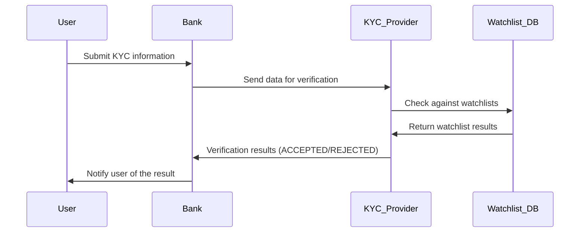

[Mermaid.js](https://mermaid.js.org/intro/) is an invaluable tool for anyone involved in software engineering, particularly for creating technical documentation such as PRDs (Product Requirement Documents), SoWs (Statements of Work), architectural documentation and general project documentation. This JavaScript-based diagramming and charting tool uses text-based definitions to generate a wide range of diagrams, making it an adaptable option for anyone who deals with technical documentation on a daily basis.

## Why I Prefer Mermaid.js for Diagrams

[Mermaid.js](https://mermaid.js.org/intro/) has been a reliable tool for me because of its simplicity and versatility. It allows you to create a variety of diagrams, such as:

- Flowcharts
- Sequence Diagrams
- Class Diagrams
- State Diagrams
- Entity Relationship Diagrams
- User Journeys
- Gantt Charts
- Pie Charts
- Requirement Diagrams

The main advantage of [Mermaid.js](https://mermaid.js.org/intro/) is its syntax, which is easy to learn and resembles Markdown. This makes it accessible even to those who don’t have a strong programming background. As a result, it’s widely used in different team environments and platforms like Slack, Discord, Obsidian, Confluence, GitHub, and more. This accessibility and ease of use make it a valuable tool for collaboration and communication.

## The adventages of Mermaid.js

### Code-Based Diagrams with Mermaid.js

Mermaid.js excels at creating diagrams using code, offering several significant benefits:

- **Consistency:** Ensures all documents have the same style and formatting, which is important for a professional look.
- **Efficiency:** Diagrams can be quickly generated and updated, saving time. Code can be easily modified to reflect changes, ideal for dynamic documentation.
- **Version Control:** Integrates with Git, enabling easy tracking of changes and collaboration in software development and documentation.
- **Browser Integration:** It can be used in browsers, making it easy to add and view diagrams on sites like GitHub, GitLab, and Markdown-supported environments. This makes it a useful tool for many different tasks.

These advantages make Mermaid.js a powerful tool for visual communication and documentation, streamlining workflows and enhancing collaborative efforts.

#### Example: Sequence Diagram

To illustrate the Know Your Customer (KYC) verification process using [Mermaid.js](https://mermaid.js.org/intro/), here's a sample sequence diagram. KYC is a critical process in the financial industry that ensures compliance and helps prevent fraud by verifying the identity of customers:
1.	The user submits information to the bank for identity verification.
2.	The bank forwards the data to the KYC provider, a third party service, which performs the verification.
3.	The KYC provider checks the data against watch lists for red flags.
4.	Watchlist results are sent back to the KYC provider.
5.	Verification outcome (either accepted or rejected) is determined.
6.	The bank notifies the user of the verification result.

Below, you can see an illustrative example of the KYC sequence diagram:

### A Game Changer for Technical Writing

Looking back on my 12 years of experience in the IT industry, I have used a variety of tools including Pencil Project, PowerPoint, UX Pin and more recently draw.io, Excalidraw, Figma and Miro. While these tools are effective for creating diagrams, I've found that coding diagrams offers greater precision and flexibility. With [Mermaid.js](https://mermaid.js.org/intro/), it is possible to make live edits in collaboration with engineers, adjusting parameters directly in the script. This ability to make changes on the fly is a huge time saver and improves the quality of the documentation.

It's almost funny how long it took me to switch to [Mermaid.js](https://mermaid.js.org/intro/)- something I only started using four years ago. Had I made the switch earlier, I would have saved an enormous amount of time otherwise spent on manual tweaking and redrawing. The efficiency and ease of use of Mermaid.js not only streamlines the workflow, but also allows for more accurate and up-to-date documentation.

## Open Source and Community-Driven

The fact that [Mermaid.js](https://mermaid.js.org/intro/) is open source is another great advantage. It benefits from a vibrant community that is constantly improving the tool, ensuring that it keeps up with the latest trends and needs. This open nature also means that it can be easily integrated into various platforms, including documentation websites, wikis and project management tools, facilitating seamless collaboration between team members.

## Conclusion

[Mermaid.js](https://mermaid.js.org/intro/) is a powerful tool for anyone involved in technical documentation. Its simplicity, versatility, and robust integration capabilities make it an invaluable asset for creating clear, consistent, and up-to-date documentation. Whether you're documenting software systems, business processes, or project schedules, Mermaid.js provides the tools you need to communicate complex information effectively.

By using [Mermaid.js](https://mermaid.js.org/intro/), teams can streamline their documentation processes, create common source of truth, and focus on producing high-quality content. If you haven't tried it yet, I highly recommend exploring what Mermaid.js has to offer - it's a game changer in the world of technical writing.
