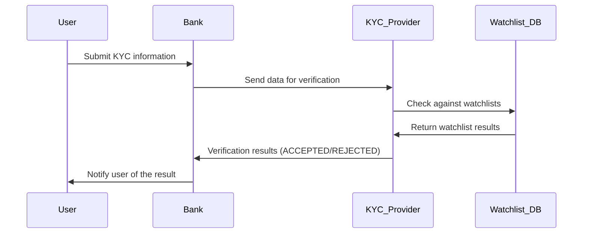
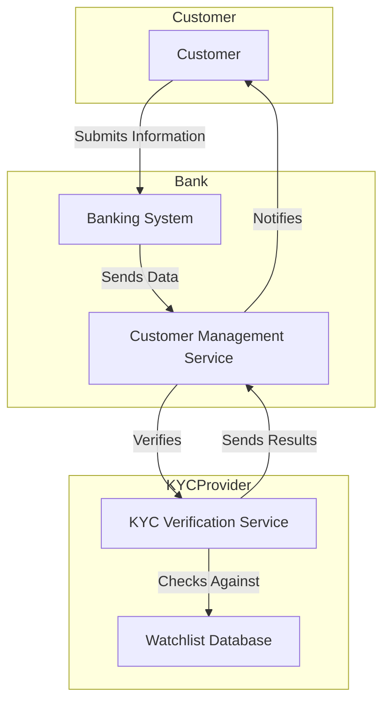
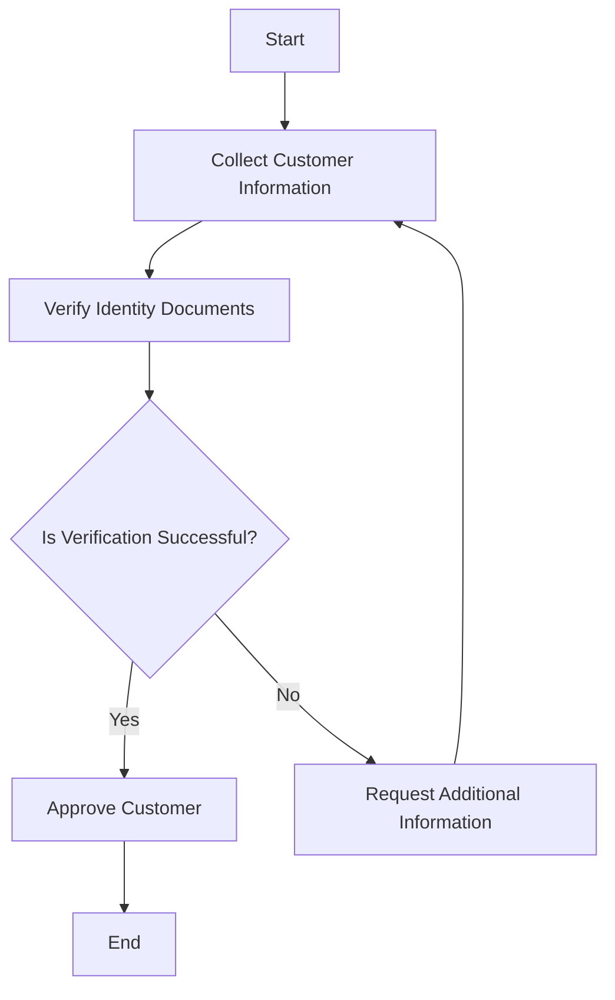
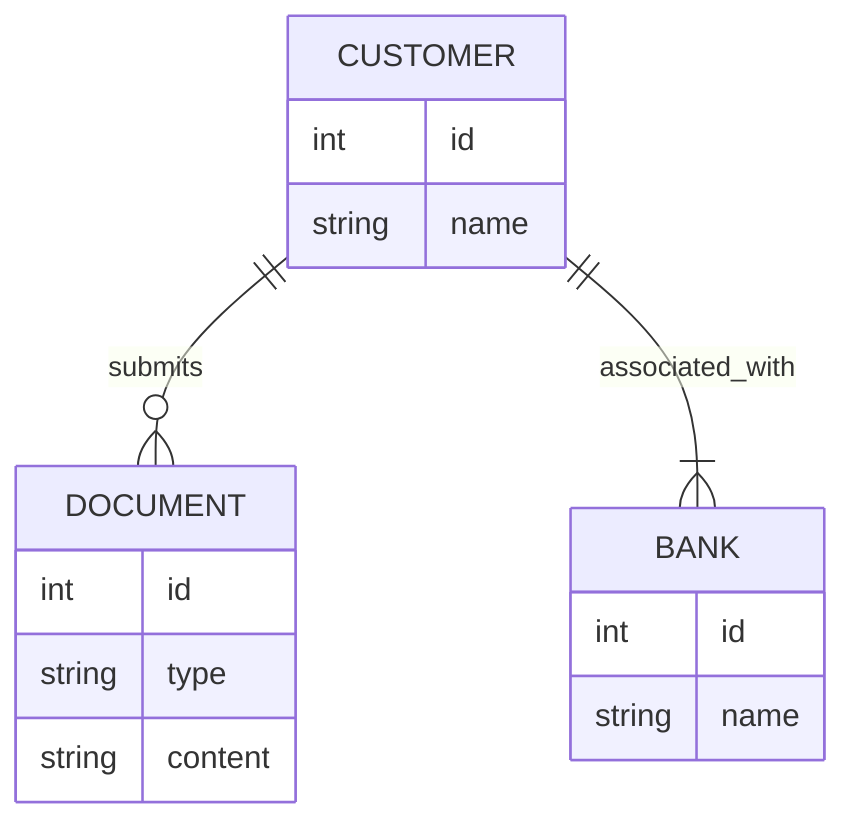

[Mermaid.js](https://mermaid.js.org/intro/) its great tool for anyone involved in software engineering and system design, especially for creating technical documents like PRDs, SoWs, architectural documentation and general project documentation. Mermaid uses text to create diagrams, making it a flexible choice for anyone who works with technical documents daily.

## Why I Prefer Mermaid.js for Diagrams

The main advantage of [Mermaid.js](https://mermaid.js.org/intro/) is its syntax, which is easy to learn and resembles Markdown. This makes it accessible even to those who don’t have a strong programming background. As a result, it’s widely used in different team environments and platforms like Slack, Discord, Obsidian, Confluence, GitHub, and more. This accessibility and ease of use make it a valuable tool for collaboration and communication.

[Mermaid.js](https://mermaid.js.org/intro/) has been a reliable tool for me because of its simplicity and versatility. It allows you to create a variety of diagrams, such as:

- Flowcharts
- Sequence Diagrams
- Class Diagrams
- State Diagrams
- Entity Relationship Diagrams
- User Journeys
- Gantt Charts
- Pie Charts
- Requirement Diagrams

## The adventages of Mermaid.js

### Code-Based Diagrams with Mermaid.js

Mermaid.js excels at creating diagrams using code, offering several significant benefits:

- **Consistency:** Ensures all documents have the same style and formatting, which is important for a professional look.
- **Efficiency:** Diagrams can be quickly generated and updated, saving time. Code can be easily modified to reflect changes, ideal for dynamic documentation.
- **Version Control:** Integrates with Git, enabling easy tracking of changes and collaboration in software development and documentation.
- **Browser Integration:** It can be used in browsers, making it easy to add and view diagrams on sites like GitHub, GitLab, and Markdown-supported environments. This makes it a useful tool for many different tasks.

These advantages make Mermaid.js a powerful tool for visual communication and documentation, streamlining workflows and enhancing collaborative efforts.

## Example: Understanding KYC with Mermaid.js diagrams

Know Your Customer (KYC) is a process in the financial industry that verifies customers' identities to ensure compliance and prevent fraud. This process involves collecting and verifying personal information and documents to confirm identities. Mermaid.js can illustrate the KYC process through various diagrams. Here are five examples:

##### 1. Sequence Diagram:

This sample sequence diagram shows how KYC helps the financial industry comply with regulations and prevent fraud.

Description:

1.	User Submission: The **user** (customer) gives the **bank** their personal and ID details. This usually includes ID, proof of address and other necessary information.
2.	Data Forwarding: The **bank** sends the information to a **third-party provider** to check it is correct.
3.	Verification Against Watchlists: The **KYC provider** checks the submitted information against various lists of people or entities that may be fraudulent or of interest.
4.	Watchlist Results: The **Watchlist_DB** sends the results back to the **KYC provider**. The results show if there are any matches or concerns based on the user's information.
5.	Verification Outcome: The **KYC provider** checks if the **user** has **passed or failed** the **verification process**.
6.	Notification to User: The **bank** gets the result from the **KYC provider** and tells the user. If more information is needed, the **bank** will ask the user for it.

This diagram shows how the KYC process works. It helps you understand how information flows in a regulated financial environment.
**Visual example:**

##### 2. KYC C4 diagram example:

A C4 diagram provides a high-level overview of the system architecture involved in the KYC process, highlighting the interaction between various components.

Description: This diagram represents the key components and interactions in the KYC system, including the customer, banking system, customer management service, KYC verification service, and watchlist database.

**Visual example:**

##### 3. Flowchart for KYC Process:
Mermaid code:

**Visual example:**

Description: This flowchart outlines the KYC process, starting from collecting customer information to verifying identity documents and making a final decision on customer approval.

##### 4. Class diagram for KYC

**Visual example:**

Description:
- Customer: Represents a person undergoing KYC verification. Each customer has an ID, name, date of birth, and a list of documents. They can submit their information for verification.
-	Document: Represents documents provided by the customer for verification (e.g., passport, driver’s license). Each document has an ID, type, and content. It can be validated as part of the verification process.
-	Bank: Represents the financial institution requiring KYC verification. Each bank has an ID, name, and a list of customers. The bank processes KYC using customer information.
-	KYCProvider: Represents a third-party service that verifies documents and checks them against watchlists. Each provider has an ID, name, and service type. They perform document verification and watchlist checking.
-	Watchlist: Represents databases of flagged individuals or entities. The watchlist has an ID, name, and description and is used by the KYCProvider to check for any matches.

This class diagram provides a structured view of the KYC system, showing how different entities interact and their roles in the KYC process.

### A Game Changer for Technical Writing

Looking back on my 12 years of experience in the IT industry, I have used a variety of tools including Pencil Project, PowerPoint, UX Pin and more recently draw.io, Excalidraw, Figma and Miro. While these tools are effective for creating diagrams, I've found that coding diagrams offers greater precision and flexibility. With [Mermaid.js](https://mermaid.js.org/intro/), it is possible to make live edits in collaboration with engineers, adjusting parameters directly in the script. This ability to make changes on the fly is a huge time saver and improves the quality of the documentation.

It's almost funny how long it took me to switch to [Mermaid.js](https://mermaid.js.org/intro/)- something I only started using four years ago. Had I made the switch earlier, I would have saved an enormous amount of time otherwise spent on manual tweaking and redrawing. The efficiency and ease of use of Mermaid.js not only streamlines the workflow, but also allows for more accurate and up-to-date documentation.

## Integrations and Community Support

Mermaid.js benefits from a strong ecosystem and community support, as highlighted on its integrations and community page. This robust ecosystem includes integrations with numerous platforms and tools, making it versatile and accessible across different workflows:

- **GitHub and GitLab:** Both platforms support native integration of Mermaid.js, allowing diagrams to be rendered in Markdown files, project documentation, and pages. This makes it easier for teams to visualize code structures, workflows, and project designs directly within their repositories.
- **Obsidian:** Plugins available for incorporating diagrams into Markdown notes, enhancing note-taking with visual elements.
- **Confluence and Jira:** Add-ons that enable embedding diagrams directly into documentation and issue tracking, improving project clarity and communication.
- **Slack:** Supports embedding diagrams in messages, helping teams visualize processes and workflows in real-time discussions.
- **Notion:** Integration allows for the inclusion of diagrams in Notion pages, aiding in the organization and presentation of information.
- **Other Markdown-based tools:** Compatibility with other Markdown-supported environments, providing flexibility for users who work across different platforms.

The community-driven nature of Mermaid.js ensures that it continuously evolves to meet the needs of its users. This open-source project encourages contributions from developers worldwide, fostering an environment of innovation and improvement. The community also offers extensive resources, including tutorials, forums, and user-contributed examples, making it easier for newcomers to get started and for experienced users to discover advanced features.

Additionally, the active community around Mermaid.js provides a platform for users to share ideas, troubleshoot issues, and stay updated on the latest developments. This collaborative spirit helps maintain a dynamic ecosystem that supports a wide range of use cases, from simple flowcharts to complex system diagrams.

## Open Source and Community-Driven

The fact that [Mermaid.js](https://mermaid.js.org/intro/) is open source is another great advantage. It benefits from a vibrant community that is constantly improving the tool, ensuring that it keeps up with the latest trends and needs. This open nature also means that it can be easily integrated into various platforms, including documentation websites, wikis and project management tools, facilitating seamless collaboration between team members.

## Conclusion

[Mermaid.js](https://mermaid.js.org/intro/) is a powerful tool for anyone involved in technical documentation. Its simplicity, versatility, and robust integration capabilities make it an invaluable asset for creating clear, consistent, and up-to-date documentation. Whether you're documenting software systems, business processes, or project schedules, Mermaid.js provides the tools you need to communicate complex information effectively.

By using [Mermaid.js](https://mermaid.js.org/intro/), teams can streamline their documentation processes, create common source of truth, and focus on producing high-quality content. If you haven't tried it yet, I highly recommend exploring what Mermaid.js has to offer - it's a game changer in the world of technical writing.
