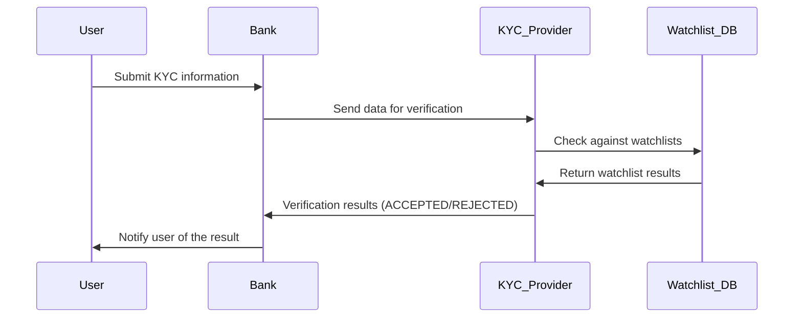
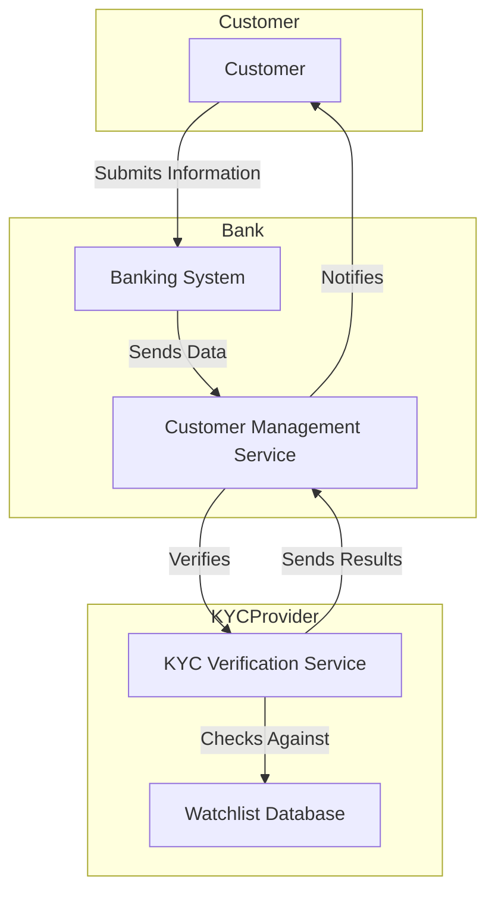
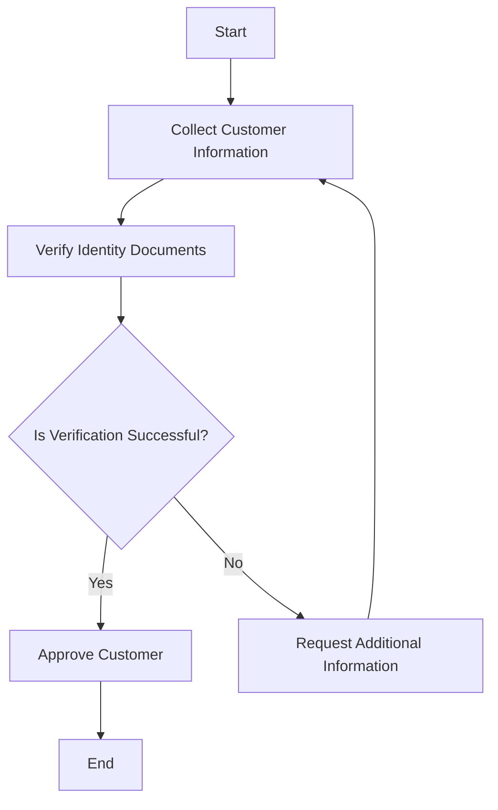
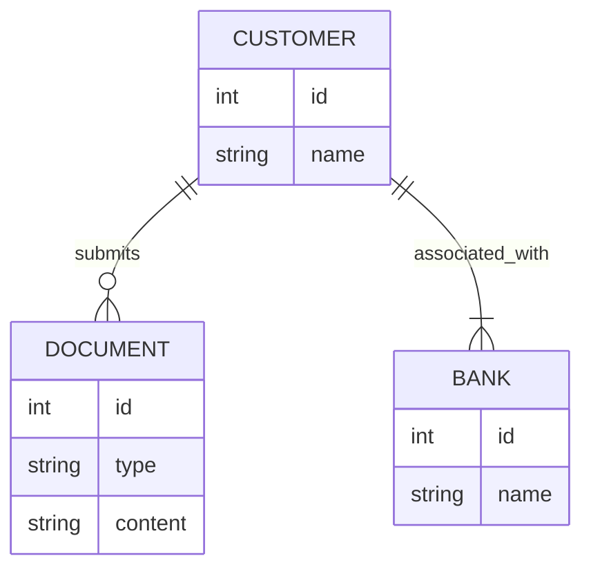

In today's world, where an increasing number of companies are embracing open-source models, it is imperative that technical documentation is clear and accessible. It is essential for software developers, system designers and those managing complex workflows to be able to visualise ideas quickly and simply. It significantly improves team understanding and communication. This is where Mermaid.js comes into play. In this article, we explore how this powerful tool streamlines the creation of technical diagrams, making it easier to present complex information in a clear and engaging manner. We'll show you how integrating Mermaid.js into your documentation process can elevate the quality and accessibility of your technical content, ensuring that your team's knowledge is shared efficiently and comprehensibly across various platforms.

## Why I Prefer Mermaid.js for Diagrams

The best thing about Mermaid is its syntax. It's simple to grasp and similar to Markdown. Plus, it has great integrations with most common software development tools. This makes it ideal for anyone, even those without a strong programming background. It's no surprise that it's used extensively in a wide range of team environments and on numerous platforms, including Slack, Discord, Obsidian, Confluence, GitHub, and more. Its accessibility and ease of use make it an invaluable tool for collaboration and communication. I've found it to be a reliable tool because it's simple and versatile. It allows you to create a variety of diagrams, such as:

- Flowcharts
- Sequence Diagrams
- Class Diagrams
- State Diagrams
- Entity Relationship Diagrams
- User Journeys
- Gantt Charts
- Pie Charts
- Requirement Diagrams

## The adventages of Mermaid.js

Mermaid.js excels at creating diagrams using code, offering several significant benefits that enhance both the quality and efficiency of technical documentation:

#### Consistency in Style and Formatting:
Mermaid.js helps maintain a uniform style and formatting across all documents, which is crucial for a professional look. This consistency ensures that documentation is clear and cohesive, making it easier for readers to understand and navigate.

#### Efficiency in Creation and Updates:
The tool allows for quick generation and updating of diagrams, which saves time. Its code-based approach makes it easy to modify diagrams, accommodating changes rapidly and efficiently. This is particularly beneficial for dynamic documentation that requires frequent updates.

#### Version Control and Collaboration:
Integration with version control systems like Git enhances collaboration and makes tracking changes straightforward. This feature is invaluable in environments where multiple contributors are involved in documentation and development, ensuring that all changes are properly documented and accessible.

#### Browser Compatibility and Versatility:
Mermaid.js can be used in web browsers, facilitating easy embedding and viewing of diagrams on platforms such as GitHub, GitLab, and other Markdown-supported environments. This capability broadens its application, making it a versatile tool for various documentation and presentation needs.

Mermaid.js is an indispensable tool for visual communication and documentation. It streamlines workflows and enhances collaborative efforts. It provides a robust framework for creating, managing, and sharing diagrams, empowering teams to communicate complex ideas more effectively. It ensures that everyone involved in a project has a clear and consistent understanding of the information presented.

## Example: Understanding KYC with Mermaid.js diagrams

Know Your Customer (KYC) is a process in the financial industry that verifies customers' identities to ensure compliance and prevent fraud. This process involves collecting and verifying personal information and documents to confirm identities. Mermaid.js can illustrate the KYC process through various diagrams. Here are five examples:

### 1. Sequence Diagram:

To illustrate the KYC verification process, here’s a sample sequence diagram. KYC is critical in ensuring compliance and fraud prevention in the financial industry:

#### Visual example:

#### Description:

1.	**User Submission:** The customer provides their personal and identification details to the bank. This typically includes identification documents, proof of address, and other necessary information.
2.	**Data Forwarding:** he bank forwards this information to a third-party provider to verify its accuracy and authenticity.
3.	**Verification Against Watchlists:** The KYC provider checks the submitted information against various watchlists to identify any individuals or entities that may be flagged for potential risks, such as fraud or other concerns.
4.	**Watchlist Results:** The results of these checks are sent back from the watchlist database to the KYC provider, indicating whether there are any matches or concerns based on the customer’s information.
5.	**Verification Outcome:** The KYC provider determines the outcome of the verification process, assessing whether the customer has successfully passed or failed the necessary checks.
6.	**Notification to User:** Finally, the bank receives the verification results from the KYC provider and informs the customer of the outcome. If further information is required, the bank will request additional details from the customer.

This sequence diagram provides a clear and structured view of the KYC process, highlighting the roles and interactions of each entity involved. It is an essential tool for understanding how information flows and is processed in a regulated financial environment.

### 2. KYC C4 diagram example:

A C4 diagram provides a high-level overview of the system architecture involved in the KYC process, highlighting the interaction between various components.

#### Visual example:

#### Description:
This diagram represents the key components and interactions in the KYC system, including the customer, banking system, customer management service, KYC verification service, and watchlist database.

### 3. Flowchart for KYC Process:
Mermaid code:

#### Visual example:

#### Description:
This flowchart outlines the KYC process, starting from collecting customer information to verifying identity documents and making a final decision on customer approval.

### 4. Class diagram for KYC

#### Visual example:

#### Description:
- Customer: Represents a person undergoing KYC verification. Each customer has an ID, name, date of birth, and a list of documents. They can submit their information for verification.
-	Document: Represents documents provided by the customer for verification (e.g., passport, driver’s license). Each document has an ID, type, and content. It can be validated as part of the verification process.
-	Bank: Represents the financial institution requiring KYC verification. Each bank has an ID, name, and a list of customers. The bank processes KYC using customer information.
-	KYCProvider: Represents a third-party service that verifies documents and checks them against watchlists. Each provider has an ID, name, and service type. They perform document verification and watchlist checking.
-	Watchlist: Represents databases of flagged individuals or entities. The watchlist has an ID, name, and description and is used by the KYCProvider to check for any matches.

This class diagram provides a structured view of the KYC system, showing how different entities interact and their roles in the KYC process.

## Integrations and Community Support

Mermaid.js benefits from a strong ecosystem and community support, as highlighted on its integrations and community page. This robust ecosystem includes integrations with numerous platforms and tools, making it versatile and accessible across different workflows:

- **GitHub and GitLab:** Both platforms support native integration of Mermaid.js, allowing diagrams to be rendered in Markdown files, project documentation, and pages. This makes it easier for teams to visualize code structures, workflows, and project designs directly within their repositories.
- **Obsidian:** Plugins available for incorporating diagrams into Markdown notes, enhancing note-taking with visual elements.
- **Confluence and Jira:** Add-ons that enable embedding diagrams directly into documentation and issue tracking, improving project clarity and communication.
- **Slack:** Supports embedding diagrams in messages, helping teams visualize processes and workflows in real-time discussions.
- **Notion:** Integration allows for the inclusion of diagrams in Notion pages, aiding in the organization and presentation of information.
- **Other Markdown-based tools:** Compatibility with other Markdown-supported environments, providing flexibility for users who work across different platforms.

The community-driven nature of Mermaid.js ensures that it continuously evolves to meet the needs of its users. This open-source project encourages contributions from developers worldwide, fostering an environment of innovation and improvement. The community also offers extensive resources, including tutorials, forums, and user-contributed examples, making it easier for newcomers to get started and for experienced users to discover advanced features. As an open-source tool, Mermaid.js benefits from a vibrant community that continuously enhances its features, keeping it aligned with current trends and user needs. This open nature facilitates seamless integration into various platforms, including documentation websites, wikis, and project management tools, supporting collaboration and efficiency in team environments.

Additionally, the active community around Mermaid.js provides a platform for users to share ideas, troubleshoot issues, and stay updated on the latest developments. This collaborative spirit helps maintain a dynamic ecosystem that supports a wide range of use cases, from simple flowcharts to complex system diagrams.

## Conclusion

Mermaid.js is a great tool for creating technical documentation. Its simple syntax and easy integration make it the best choice for creating clear, consistent, and up-to-date diagrams. Mermaid.js helps you document software, business processes and project schedules. It makes complex information accessible and accurate.

Mermaid.js is useful even though it is easy to use. It transforms the documentation process, encouraging collaboration and establishing a shared source of truth, making it more efficient and accurate. It's a big deal for teams and individuals to be able to quickly produce high-quality documentation.

In my 12 years in IT, I've used many tools, including Pencil Project, PowerPoint, UX Pin, draw.io, Excalidraw, Figma, and Miro. These tools have their uses, but none can match the precision and flexibility of coding diagrams with Mermaid.js. Being able to make changes with engineers in real time saves time and makes the documentation better.

If I had used Mermaid.js sooner, I would have saved a lot of time. It is very efficient and simple to use, which makes it a must for anyone who writes technical documents. If you haven't tried it, you are missing out on a great way to keep your documents up to date!
