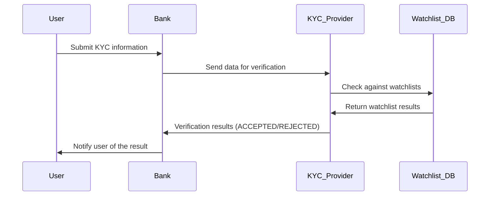

Mermaid.js is an invaluable tool for all those engaged in software engineering, particularly for the creation of technical documentation such as PRDs (Product Requirement Documents), SoWs (Statements of Work) and general project documentation. This JavaScript-based diagramming and charting tool employs text-based definitions to generate a vast array of diagrams, making it an adaptable option for anyone who deal with technical documentation on a daily basics.

## Why I Love Mermaid.js

Over the years, I've found Mermaid.js to be my go-to tool for its simplicity and power. It allows for the creation of:

- Flowcharts
- Sequence Diagrams
- Class Diagrams
- State Diagrams
- Entity Relationship Diagrams
- User Journeys
- Gantt Charts
- Pie Charts
- Requirement Diagrams

The key to its ease of use is its syntax, which is similar to Markdown. This familiarity makes it accessible to users without a deep programming background, which is a big plus in environments where team members might be using various tools like Slack, Discord, Obsidian, Confluence, GitHub, and more.

## The Benefits of Mermaid.js

### Code-Based Diagrams

One of the standout features of Mermaid.js is the ability to create diagrams as code. This approach offers several advantages:

- **Consistency:** Ensures that diagrams maintain a uniform style and formatting across different documents.
- **Efficiency:** Saves time by eliminating the need for manual drawing and formatting.
- **Version Control:** Allows for easy tracking and updating of diagram versions, which is crucial for maintaining accurate documentation.

#### Example: Sequence Diagram

To illustrate the Know Your Customer (KYC) verification process using Mermaid.js, here's a sample sequence diagram. KYC is a critical process in the financial industry that ensures compliance and helps prevent fraud by verifying the identity of customers:
	1.	User submits information to the bank for identity verification.
	2.	The bank forwards the data to the KYC provider, a third-party service, which performs the verification.
	3.	KYC provider checks the data against watchlists for red flags.
	4.	Watchlist results are sent back to the KYC provider.
	5.	Verification outcome (either accepted or rejected) is determined.
	6.	The bank notifies the user of the verification result.

Here, you can see an example image of the sequence diagram:

### A Game Changer for Technical Writing

Looking back on my 12 years of experience in the IT industry, I have used a variety of tools including Pencil Project, PowerPoint, UX Pin and more recently draw.io, Excalidraw, Figma and Miro. While these tools are effective for creating diagrams, I've found that coding diagrams offers greater precision and flexibility. With Mermaid.js, it is possible to make live edits in collaboration with engineers, adjusting parameters directly in the script. This ability to make changes on the fly is a huge time saver and improves the quality of the documentation.

It's almost funny how long it took me to switch to Mermaid.js - something I only started using four years ago. Had I made the switch earlier, I would have saved an enormous amount of time otherwise spent on manual tweaking and redrawing. The efficiency and ease of use of Mermaid.js not only streamlines the workflow, but also allows for more accurate and up-to-date documentation.

## Open Source and Community-Driven

The fact that Mermaid.js is open source is another great advantage. It benefits from a vibrant community that is constantly improving the tool, ensuring that it keeps up with the latest trends and needs. This open nature also means that it can be easily integrated into various platforms, including documentation websites, wikis and project management tools, facilitating seamless collaboration between team members.

## Conclusion

Mermaid.js is a powerful tool for anyone involved in technical documentation. Its simplicity, versatility, and robust integration capabilities make it an invaluable asset for creating clear, consistent, and up-to-date documentation. Whether you're documenting software systems, business processes, or project schedules, Mermaid.js provides the tools you need to communicate complex information effectively.

By using Mermaid.js, teams can streamline their documentation processes, create common source of truth, and focus on producing high-quality content. If you haven't tried it yet, I highly recommend exploring what Mermaid.js has to offer - it's a game changer in the world of technical writing.
